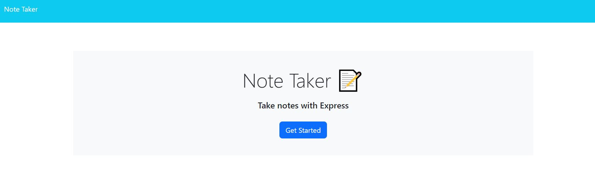
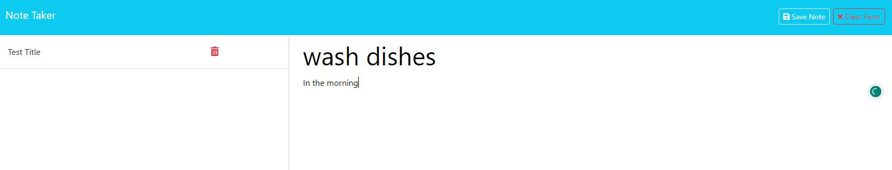
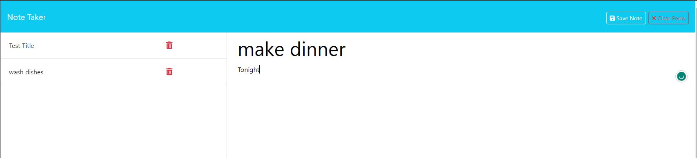
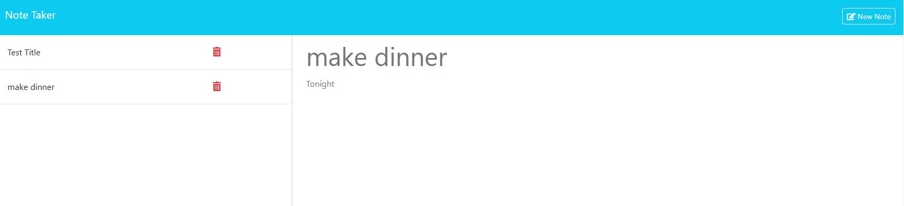

# note-pad

## Descriptions 
This project we made a note taker app where you can type in a note, and it would save on a list where you can later on click on that note to revist what you typed as well as being able to delete the note. This projected demostrated the use of express.js and how we can use it to construct our website.

## Usage
.
.
.
.

## Credits
I used the activities in the UCSD folder to help me with this project as well as the help of a tutor. I also want to link a YouTube tutorial that helped me better understand how to do this project.

## License
N/A

## Features
Created notes where the user can save and revist to either delete them or check what the note said using express.js and node.

## Deployed Application
https://github.com/Aserrano7/note-pad
https://secret-garden-51001-bb39f8754819.herokuapp.com/